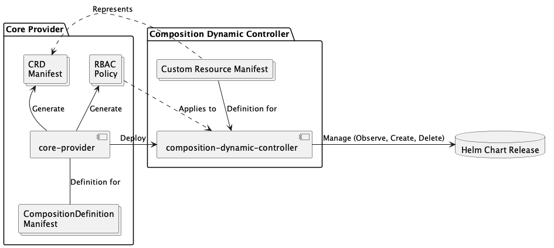

# Krateo Core Provider

The [core-provider](https://github.com/krateoplatformops/core-provider) is the first function of Krateo Composable Operations (KCO) and is vital in the Krateo PlatformOps product.

## Summary

- [Architecture](#architecture)
- [Overview](#overview)
- [Examples](#examples)
- [Configuration](#configuration)
  
### Architecture



### Overview

The product assumes that Kubernetes is the standard for IT process orchestration, bringing together business application developers and infrastructure automation developers.

Helm is the most widely used tool for composing multiple Kubernetes manifests. However, Helm is not a resource natively recognized by Kubernetes. To install a Helm chart, you need to use the relevant CLI or tools configured to acknowledge Helm charts and install them on the cluster.

The `core-provider` is a Kubernetes operator that downloads a Helm chart using one of three possible methods (via tgz, Helm repo, or OCI image). It checks for the existence of `values.schema.json` for linting the Helm chart and uses it to generate a Custom Resource Definition in Kubernetes. This definition accurately represents the possible values that can be expressed for the installation of the chart.

Kubernetes is designed to validate resource inputs before applying them to the cluster, and we adhere to this hard requirement throughout Krateo development. That's why we created the `core-provider`, which provides input validation and ensures that incorrect inputs are not even accepted in the first place.

#### Recent Improvements

- Updated provider-runtime to v0.9.0 and Helm to v0.15.4 to address security vulnerabilities
- Implemented project refactoring for improved maintainability
- Added mutating webhook and conversion webhook to support multiple composition versions

#### Multi-Version Support

With the latest release of core-provider (v0.18.1), it's now possible to manage multiple versions of the same chart, including different values for each version. This feature addresses the common requirement of maintaining multiple versions of a composition.

### Composition Definition

A Composition is an Helm Chart archive (.tgz) with a JSON Schema for the `values.yaml` file. The JSON Schema file must be named `values.schema.json`.

Here are some online tools to generate and validate JSON Schemas:

- https://jsonformatter.org/yaml-to-jsonschema
- https://codebeautify.org/yaml-to-json-schema-generator
- https://www.jsonschemavalidator.net/
- https://json-schema.hyperjump.io/

### Examples

#### How to Install

```sh
$ helm repo add krateo https://charts.krateo.io
$ helm repo update krateo
$ helm install krateo-core-provider krateo/core-provider
```

#### Apply the CompositionDefinition Manifest

```yaml
apiVersion: core.krateo.io/v1alpha1
kind: Definition
metadata:
  annotations:
     "krateo.io/connector-verbose": "true"
     "krateo.io/paused": "false"
     "krateo.io/release-name": "my-composition-release"
  name: postgresql
  namespace: krateo-system
spec:
  chart:
    url: oci://registry-1.docker.io/bitnamicharts/postgresql
    version: "12.8.3"
```

When the `CompositionDefinition` manifest is applied in the cluster, the `core-provider` generates the CRDs from the schema defined in the `values.schema.json` file included in the chart. It then deploys an instance of the [`composition-dynamic-controller`](https://github.com/krateoplatformops/composition-dynamic-controller), instructing it to manage resources of the type defined by the CRD. The deployment applies the most restrictive RBAC policy possible, ensuring that the `composition-dynamic-controller` instance can only manage the resources contained within the chart.

Upon deleting the CR, the `composition-dynamic-controller` instance is undeployed, and the RBAC policy is removed.

Certainly! I'll correct the grammar and restructure the text for better readability. Here's the improved version:

### Multi-Version Management

The core provider now supports managing multiple versions of the same composition.

The first step to perform is creating a new `CompositionDefinition` with the same chart at a different version. The `core-provider` will update the existing `CustomResourceDefinition` by adding the schema of the new version and deploy another instance of the CDC enabled to manage only this specific version.

At this point, you can upgrade and rollback a chart release following these instructions:

#### Upgrading from v1 to v2

To upgrade the same release from version 1 to version 2:

1. Pause composition v1:
   Add the `"krateo.io/paused": "true"` annotation to the CompositionDefinition for version 1.

2. Install composition v2:
   Create a new CompositionDefinition for version 2 without the `krateo.io/paused` annotation or set it to `"false"`.
   Include the `"krateo.io/release-name": "my-composition-release"` annotation, using the same name as the release for version 1. This ensures that the upgrade is performed correctly.

Note: If omitted, the CDC will use the composition's `metadata.name` as the release name.

#### Rolling Back from v2 to v1

To rollback the same release from version 2 to version 1:

1. Pause composition v2:
   Add the `"krateo.io/paused": "true"` annotation to the CompositionDefinition for version 2.

2. Resume composition v1:
   Set the `"krateo.io/paused": "false"` annotation on the CompositionDefinition for version 1.

This process allows for seamless upgrades and rollbacks between different versions of the same composition, maintaining consistency in release names and ensuring proper management of multiple versions.

### Configuration

To view the CRD configuration, visit [this link](https://doc.crds.dev/github.com/krateoplatformops/core-provider).

#### Security Features

- Generates CRDs based on the chart's schema, preventing invalid configurations
- Deploys `composition-dynamic-controller` with minimal necessary permissions
- Removes RBAC policies upon deletion of the CR
- Implements mutating webhook and conversion webhook for enhanced security and flexibility

#### Best Practices

1. Always include a `values.schema.json` file in your Helm charts
2. Use the `krateo.io/paused` annotation to manage composition lifecycle
3. Utilize the `krateo.io/release-name` annotation for consistent naming across versions
4. Leverage the multi-version support for smooth upgrades and rollbacks

By implementing these improvements and best practices, the Krateo Core Provider offers enhanced flexibility, security, and version management capabilities for Kubernetes-based applications.